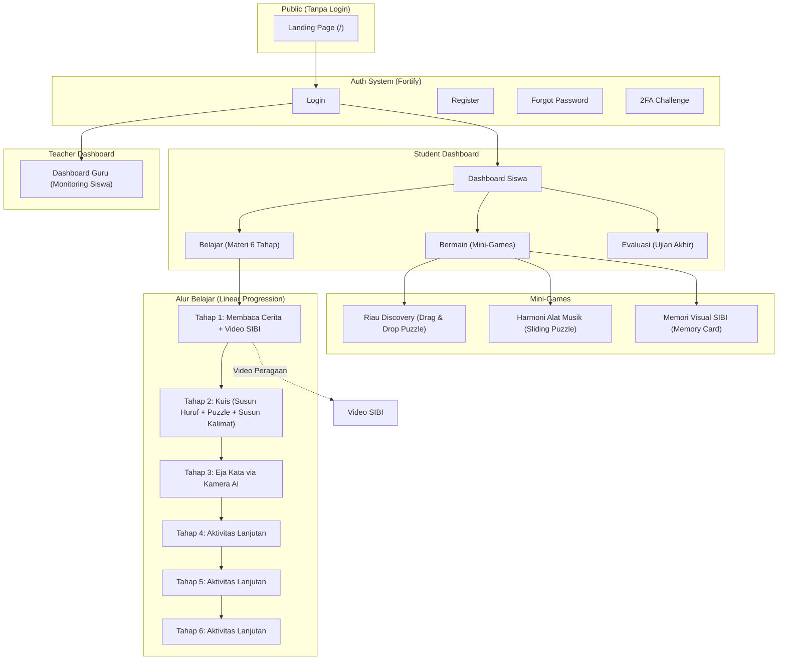
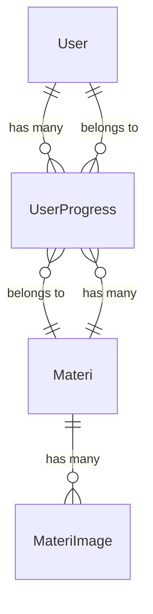
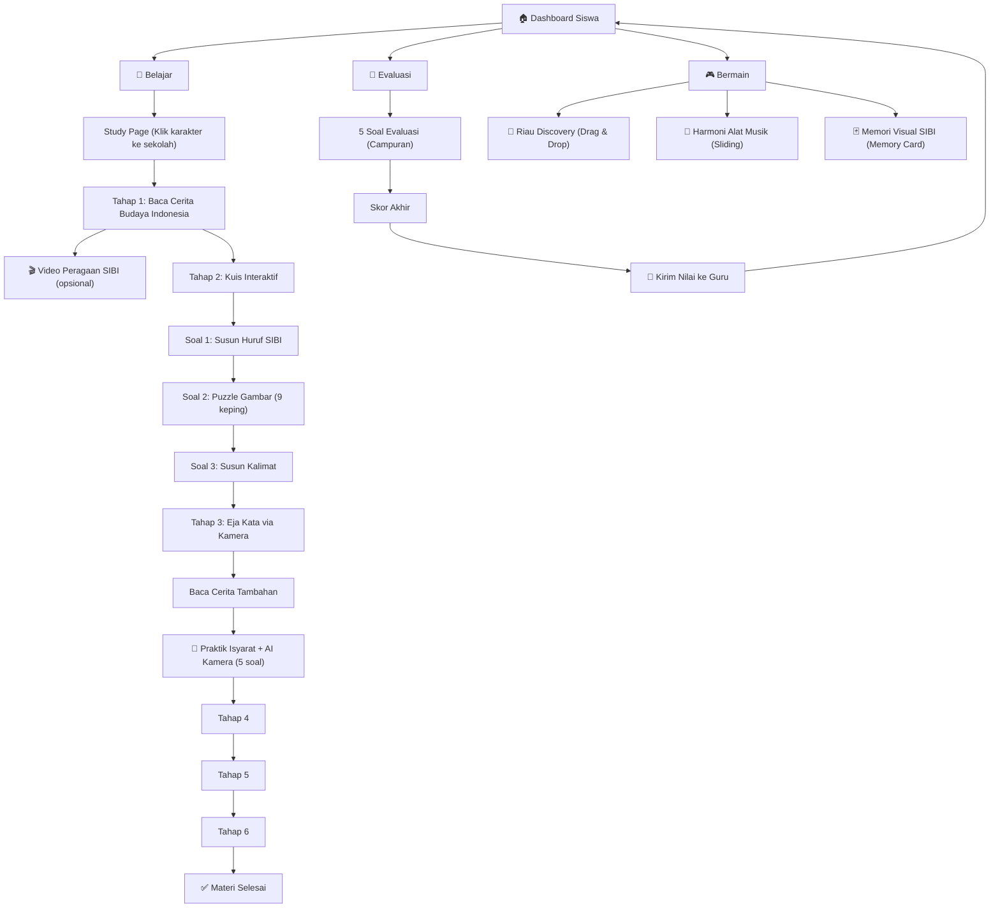
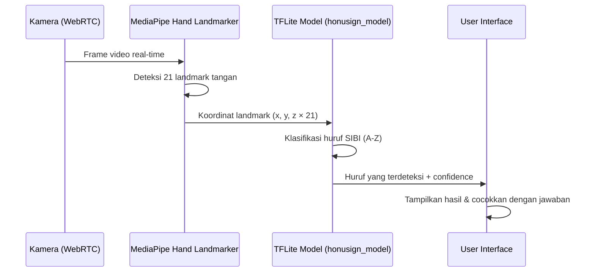

# 📚 HonuSign — Dokumentasi Proyek Lengkap

> **"Visual is Communication."**
> Platform Edukasi Bahasa Isyarat SIBI Interaktif untuk Anak Tunarungu

---

## I. Ringkasan Proyek

| Item | Detail |
|---|---|
| **Nama Proyek** | HonuSign |
| **Tagline** | Belajar SIBI Interaktif — Mudah & Seru! |
| **Jenis Aplikasi** | Web Application (Full-Stack) |
| **Target Pengguna** | Anak tunarungu (siswa SLB), Guru pendamping |
| **Tujuan** | Membantu anak tunarungu belajar bahasa isyarat SIBI melalui pendekatan visual-first, gamifikasi, dan deteksi AI kamera |
| **Konteks** | Proyek LIDM (Lomba Inovasi Digital Mahasiswa) 2026 |
| **Database** | `HonuSign` (MySQL) |
| **Status** | Dalam Pengembangan Aktif |

### Apa itu HonuSign?

HonuSign adalah platform pembelajaran berbasis web yang dirancang **khusus untuk anak tunarungu**. Seluruh antarmuka dibangun dengan prinsip **deaf-friendly** — tidak bergantung pada audio sama sekali. Semua feedback, instruksi, dan interaksi disampaikan secara **visual**.

Platform ini menggabungkan:
- 📖 **Materi cerita** bertema budaya Indonesia
- 🎮 **Mini-games edukatif** (puzzle, memory card, sliding puzzle)
- 📹 **Video peragaan SIBI** (Sistem Isyarat Bahasa Indonesia)
- 🤖 **Deteksi isyarat tangan real-time** menggunakan AI + kamera
- 📊 **Dashboard guru** untuk monitoring progres siswa

---

## II. Technology Stack

### Backend

| Teknologi | Versi | Fungsi |
|---|---|---|
| **PHP** | 8.4 | Bahasa pemrograman utama |
| **Laravel Framework** | v13 | Full-stack PHP framework |
| **Laravel Fortify** | v1 | Backend autentikasi (login, register, 2FA, reset password) |
| **Livewire** | v4 | Komponen interaktif real-time tanpa JavaScript framework |
| **Livewire Flux** | v2 | UI component library untuk Livewire |
| **MySQL** | — | Relational database |
| **Laravel Tinker** | v3 | REPL untuk debugging |

### Frontend

| Teknologi | Versi | Fungsi |
|---|---|---|
| **Blade Templates** | — | Template engine Laravel |
| **Tailwind CSS** | v4 | Utility-first CSS framework |
| **Vite** | v8 | Build tool & dev server |
| **JavaScript (Vanilla)** | ES6+ | Logika interaktif client-side |
| **Google Fonts (Fredoka)** | — | Typography utama (rounded, child-friendly) |

### AI / Machine Learning (Client-Side)

| Teknologi | Fungsi |
|---|---|
| **MediaPipe Tasks Vision** (`@mediapipe/tasks-vision`) | Hand landmark detection — mendeteksi 21 titik tangan dari kamera |
| **TensorFlow.js TFLite** (`@tensorflow/tfjs-tflite`) | Menjalankan model klasifikasi isyarat tangan |
| **`hand_landmarker.task`** (7.8 MB) | Model MediaPipe untuk deteksi landmark tangan |
| **`honusign_model.tflite`** (40 KB) | Model TFLite custom untuk klasifikasi huruf SIBI (A-Z) |
| **WebAssembly (WASM)** | Runtime eksekusi model AI di browser |

> [!IMPORTANT]
> Semua inferensi AI berjalan **di sisi client (browser)** — tidak ada data kamera yang dikirim ke server. Model dimuat dari folder `public/models/`.

### DevOps & Tooling

| Tool | Fungsi |
|---|---|
| **Laravel Pint** | PHP code formatter (PSR-12) |
| **PHPUnit** | Testing framework |
| **Laravel Sail** | Docker dev environment |
| **Laravel Boost** | MCP server untuk development |
| **Laravel Pail** | Real-time log viewer |
| **Concurrently** | Menjalankan multiple dev process (server + queue + vite) |

---

## III. Arsitektur Aplikasi

### Pola Arsitektur

```
Laravel MVC + Livewire (TALL Stack variant)
├── Model     → Eloquent ORM (User, Materi, Quiz, UserProgress)
├── View      → Blade Templates + Livewire Components
├── Controller→ Route closures di web.php (tanpa controller terpisah)
└── AI Layer  → Client-side inference (MediaPipe + TFLite di browser)
```

### Diagram Alur Tingkat Tinggi



---

## IV. Sistem Role & Autentikasi

### Role Pengguna

| Role | Nilai di DB | Akses |
|---|---|---|
| **Siswa (Student)** | `student` | Dashboard siswa, materi belajar, mini-games, evaluasi |
| **Guru (Teacher)** | `teacher` | Dashboard guru (monitoring progres semua siswa) |

### Middleware

| Middleware | File | Fungsi |
|---|---|---|
| `auth` | Laravel built-in | Memastikan user sudah login |
| `verified` | Laravel built-in | Memastikan email sudah diverifikasi |
| `teacher` | [`EnsureUserIsTeacher.php`](file:///c:/Users/M%20S%20I/Downloads/HonuSign/app/Http/Middleware/EnsureUserIsTeacher.php) | Memastikan user memiliki role `teacher`, jika tidak → redirect ke `/dashboard` |

### Fitur Auth (via Fortify)

- ✅ Login & Logout
- ✅ Registrasi akun baru
- ✅ Lupa password / Reset password
- ✅ Verifikasi email
- ✅ Two-Factor Authentication (2FA / TOTP)
- ✅ Konfirmasi password
- ✅ Rate limiting login (5 percobaan/menit)

### Akun Seeder Default

| Akun | Email | Password | Role |
|---|---|---|---|
| Pak Guru Han | `guru@honusign.test` | `password` | `teacher` |
| 10 Siswa Dummy | Random (Factory) | Random | `student` |

---

## V. Database Schema

### Tabel: `users`

| Kolom | Tipe | Keterangan |
|---|---|---|
| `id` | bigint (PK) | Auto-increment |
| `name` | string | Nama lengkap |
| `email` | string (unique) | Email login |
| `email_verified_at` | timestamp (nullable) | Waktu verifikasi email |
| `password` | string (hashed) | Password (bcrypt) |
| `role` | string | `student` atau `teacher` |
| `two_factor_secret` | text (nullable) | Secret key 2FA |
| `two_factor_recovery_codes` | text (nullable) | Recovery codes 2FA |
| `two_factor_confirmed_at` | timestamp (nullable) | Waktu konfirmasi 2FA |
| `remember_token` | string (nullable) | Token "Remember Me" |
| `created_at` / `updated_at` | timestamps | Audit trail |

### Tabel: `materis`

| Kolom | Tipe | Keterangan |
|---|---|---|
| `id` | bigint (PK) | Auto-increment |
| `order` | integer | Urutan materi (1, 2, 3...) |
| `judul` | string | Judul materi (contoh: "Festival Budaya Kemerdekaan Indonesia") |
| `slug` | string | URL-friendly slug |
| `video_peragaan` | string | Nama file gambar/video ilustrasi |
| `deskripsi` | text | Isi cerita utama (Tahap 1 & 3) |
| `deskripsi_tambahan` | text (nullable) | Cerita tambahan (Tahap 3/5) |
| `created_at` / `updated_at` | timestamps | Audit trail |

### Tabel: `quizzes`

| Kolom | Tipe | Keterangan |
|---|---|---|
| `id` | bigint (PK) | Auto-increment |
| `tipe` | string | Jenis soal: `susun_huruf`, `puzzle`, `susun_kalimat`, `eja_kata` |
| `pertanyaan` | text | Teks pertanyaan |
| `jawaban_benar` | string | Jawaban yang benar |
| `pilihan_data` | json (nullable) | Data tambahan (kata acak, pilihan jawaban) |
| `created_at` / `updated_at` | timestamps | Audit trail |

### Tabel: `user_progresses`

| Kolom | Tipe | Keterangan |
|---|---|---|
| `id` | bigint (PK) | Auto-increment |
| `user_id` | FK → `users.id` | ID siswa (cascade on delete) |
| `materi_id` | FK → `materis.id` | ID materi (cascade on delete) |
| `tahap` | integer | Nomor tahap (1-6, atau 7 untuk evaluasi) |
| `score` | integer (default: 0) | Nilai yang didapat (0-100) |
| `is_completed` | boolean (default: false) | Apakah tahap sudah diselesaikan |
| `created_at` / `updated_at` | timestamps | Audit trail |

### Tabel: `materi_images`

| Kolom | Tipe | Keterangan |
|---|---|---|
| `id` | bigint (PK) | Auto-increment |
| `materi_id` | FK → `materis.id` | Relasi ke materi induk |
| *(kolom gambar)* | — | Gambar pendukung untuk puzzle, mewarnai, dll |

### Relasi Antar Model



---

## VI. Semua Halaman & Route

### Halaman Publik (Tanpa Login)

| Route | URL | View | Deskripsi |
|---|---|---|---|
| `home` | `/` | [`welcome.blade.php`](file:///c:/Users/M%20S%20I/Downloads/HonuSign/resources/views/welcome.blade.php) | Landing page dengan hero section, fitur unggulan, tentang kami, CTA |

### Halaman Auth (Fortify)

| Route | URL | View | Deskripsi |
|---|---|---|---|
| — | `/login` | [`login.blade.php`](file:///c:/Users/M%20S%20I/Downloads/HonuSign/resources/views/pages/auth/login.blade.php) | Halaman login |
| — | `/register` | [`register.blade.php`](file:///c:/Users/M%20S%20I/Downloads/HonuSign/resources/views/pages/auth/register.blade.php) | Halaman registrasi |
| — | `/forgot-password` | [`forgot-password.blade.php`](file:///c:/Users/M%20S%20I/Downloads/HonuSign/resources/views/pages/auth/forgot-password.blade.php) | Lupa password |
| — | `/reset-password` | [`reset-password.blade.php`](file:///c:/Users/M%20S%20I/Downloads/HonuSign/resources/views/pages/auth/reset-password.blade.php) | Reset password |
| — | `/email/verify` | [`verify-email.blade.php`](file:///c:/Users/M%20S%20I/Downloads/HonuSign/resources/views/pages/auth/verify-email.blade.php) | Verifikasi email |
| — | `/two-factor-challenge` | [`two-factor-challenge.blade.php`](file:///c:/Users/M%20S%20I/Downloads/HonuSign/resources/views/pages/auth/two-factor-challenge.blade.php) | Tantangan 2FA |
| — | `/confirm-password` | [`confirm-password.blade.php`](file:///c:/Users/M%20S%20I/Downloads/HonuSign/resources/views/pages/auth/confirm-password.blade.php) | Konfirmasi password |

### Dashboard & Navigasi Utama (Butuh Login)

| Route | URL | View | Deskripsi |
|---|---|---|---|
| `dashboard` | `/dashboard` | [`dashboard.blade.php`](file:///c:/Users/M%20S%20I/Downloads/HonuSign/resources/views/dashboard.blade.php) | Dashboard siswa — 3 menu utama: Bermain, Belajar, Evaluasi |
| `teacher.dashboard` | `/teacher/dashboard` | [`teacher/dashboard.blade.php`](file:///c:/Users/M%20S%20I/Downloads/HonuSign/resources/views/teacher/dashboard.blade.php) | Dashboard guru — tabel monitoring progres siswa |
| `logout` | `POST /logout` | — | Logout dan redirect ke `/` |

> [!NOTE]
> Route `/dashboard` otomatis melakukan redirect: jika user adalah **guru** → redirect ke `teacher.dashboard`, jika **siswa** → tampilkan dashboard siswa.

### Halaman Bermain (Mini-Games)

| Route | URL | View | Deskripsi |
|---|---|---|---|
| `general.index` | `/general` | [`general/index.blade.php`](file:///c:/Users/M%20S%20I/Downloads/HonuSign/resources/views/general/index.blade.php) | Menu pilihan 3 game |
| `general.puzzle` | `/general/puzzle` | [`general/puzzle.blade.php`](file:///c:/Users/M%20S%20I/Downloads/HonuSign/resources/views/general/puzzle.blade.php) | **Riau Discovery** — Drag & drop puzzle peta Provinsi Riau |
| `general.puzzle_instrument` | `/general/puzzle_instrument` | [`general/puzzle_instrument.blade.php`](file:///c:/Users/M%20S%20I/Downloads/HonuSign/resources/views/general/puzzle_instrument.blade.php) | **Harmoni Alat Musik** — Sliding puzzle alat musik tradisional Riau |
| `general.memory` | `/general/memory` | [`general/memory.blade.php`](file:///c:/Users/M%20S%20I/Downloads/HonuSign/resources/views/general/memory.blade.php) | **Memori Visual SIBI** — Memory card game mencocokkan isyarat tangan |

### Halaman Belajar (Materi — Linear Progression)

| Route | URL | View | Deskripsi |
|---|---|---|---|
| `materi.index` | `/materi` | [`materi/study-page.blade.php`](file:///c:/Users/M%20S%20I/Downloads/HonuSign/resources/views/materi/study-page.blade.php) | Halaman game animasi: klik karakter untuk masuk ke sekolah |
| `materi.tahap1.video` | `/materi/tahap1/video` | [`materi/tahap1/tahap1video.blade.php`](file:///c:/Users/M%20S%20I/Downloads/HonuSign/resources/views/materi/tahap1/tahap1video.blade.php) | Video peragaan bahasa isyarat SIBI |
| `materi.belajar` | `/materi/belajar/{step}/{soal_ke?}` | *(dinamis per tahap)* | Halaman pembelajaran linear |

#### Detail Per Tahap Belajar

| Tahap | View | Konten |
|---|---|---|
| **Tahap 1** — Membaca Cerita | [`tahap1.blade.php`](file:///c:/Users/M%20S%20I/Downloads/HonuSign/resources/views/materi/tahap1/tahap1.blade.php) | Membaca cerita bertema budaya Indonesia ("Festival Budaya Kemerdekaan Indonesia"). Terdapat kartu karakter, ilustrasi, dan tombol menuju video SIBI |
| **Tahap 2** — Kuis Interaktif | [`soal1.blade.php`](file:///c:/Users/M%20S%20I/Downloads/HonuSign/resources/views/materi/tahap2/soal1.blade.php), [`soal2.blade.php`](file:///c:/Users/M%20S%20I/Downloads/HonuSign/resources/views/materi/tahap2/soal2.blade.php), [`soal3.blade.php`](file:///c:/Users/M%20S%20I/Downloads/HonuSign/resources/views/materi/tahap2/soal3.blade.php) | 3 jenis soal berurutan: (1) Susun huruf SIBI, (2) Puzzle gambar 9 keping, (3) Susun kalimat dari kata acak |
| **Tahap 3** — Eja Kata via Kamera AI | [`tahap3_baca.blade.php`](file:///c:/Users/M%20S%20I/Downloads/HonuSign/resources/views/materi/tahap3/tahap3_baca.blade.php), [`tahap3_kamera.blade.php`](file:///c:/Users/M%20S%20I/Downloads/HonuSign/resources/views/materi/tahap3/tahap3_kamera.blade.php) | Baca cerita tambahan → lalu **praktik mengeja kata** lewat kamera menggunakan AI deteksi isyarat (5 soal cerita) |
| **Tahap 4** | [`tahap4.blade.php`](file:///c:/Users/M%20S%20I/Downloads/HonuSign/resources/views/materi/tahap4/tahap4.blade.php) | Aktivitas lanjutan |
| **Tahap 5** | [`tahap5.blade.php`](file:///c:/Users/M%20S%20I/Downloads/HonuSign/resources/views/materi/tahap5/tahap5.blade.php) | Aktivitas lanjutan |
| **Tahap 6** | [`tahap6.blade.php`](file:///c:/Users/M%20S%20I/Downloads/HonuSign/resources/views/materi/tahap6/tahap6.blade.php) | Aktivitas lanjutan |

### Halaman Evaluasi

| Route | URL | View | Deskripsi |
|---|---|---|---|
| `evaluasi.index` | `/evaluasi` | [`evaluasi/index.blade.php`](file:///c:/Users/M%20S%20I/Downloads/HonuSign/resources/views/evaluasi/index.blade.php) | Ujian akhir — 5 soal campuran (pilihan gambar, pilihan ganda, puzzle). Skor otomatis dikirim ke guru |

### Halaman Settings (Livewire)

| Route | URL | Deskripsi |
|---|---|---|
| `profile.edit` | `/settings/profile` | Edit profil (nama, email) |
| `appearance.edit` | `/settings/appearance` | Pengaturan tampilan (dark/light mode) |
| `security.edit` | `/settings/security` | Keamanan (password, 2FA) |

### API Endpoints (Internal)

| Route | Method | URL | Deskripsi |
|---|---|---|---|
| `materi.save_progress` | `POST` | `/materi/save-progress` | Simpan/update nilai & progres siswa per tahap |
| `materi.reset_progress` | `POST` | `/materi/reset-progress` | Reset semua progres siswa (hapus semua UserProgress milik user) |

---

## VII. Alur Pembelajaran Siswa



### Sistem Penilaian

- Setiap tahap menyimpan **skor** dan status **is_completed** ke tabel `user_progresses`
- Guru dapat melihat progres semua siswa (Tahap 1-6 + Evaluasi) di dashboard guru
- Skor evaluasi dihitung otomatis: `(jawaban benar / total soal) × 100`
- Terdapat fitur reset progress untuk mengulangi semua materi

---

## VIII. Fitur AI Deteksi Isyarat Tangan

### Cara Kerja



### Model AI

| Model | File | Ukuran | Fungsi |
|---|---|---|---|
| Hand Landmarker | `public/models/hand_landmarker.task` | 7.8 MB | Deteksi posisi 21 titik sendi tangan |
| HonuSign Classifier | `public/models/honusign_model.tflite` | 40 KB | Klasifikasi huruf isyarat SIBI A-Z |

### Aset Isyarat SIBI

Folder `public/images/sibi/` berisi **26 gambar** referensi isyarat tangan SIBI (A.jpg — Z.jpg) yang digunakan di memory game dan referensi visual.

---

## IX. Konten Materi & Kuis

### Materi Cerita (Seeder)

**Cerita Utama (Tahap 1):**
- **Judul:** "Festival Budaya Kemerdekaan Indonesia"
- **Setting:** Kelas 4 SLB Insan Mutiara Pekanbaru
- **Tema:** Gotong royong, keberagaman budaya, Hari Kemerdekaan 17 Agustus
- **Tokoh:** Samsul (teluk belanga), Siti (bundo kanduang), Abdul (kanigaran)

**Cerita Tambahan (Tahap 3):**
- **Setting:** Lapangan sekolah di Dumai
- **Tema:** Persatuan, paduan suara "Satu Nusa Satu Bangsa", keberagaman suku
- **Tokoh:** Made (Bali), Samsul (Melayu Riau), Udin (Jawa), Siti

### Data Kuis (Seeder)

| # | Tipe | Pertanyaan | Jawaban | Dipakai di |
|---|---|---|---|---|
| 1 | `susun_huruf` | Siapa tokoh yang pakai teluk belanga? | SAMSUL | Tahap 2, Soal 1 |
| 2 | `puzzle` | Susun potongan gambar menjadi utuh! | kelas.png | Tahap 2, Soal 2 |
| 3 | `susun_kalimat` | Susun kata menjadi kalimat benar | "Aku pergi ke Sekolah untuk belajar" | Tahap 2, Soal 3 |
| 4 | `eja_kata` | Lagu Satu Nusa diciptakan oleh... | LMANIK | Tahap 3 (Kamera) |
| 5 | `eja_kata` | Apa yang dilakukan Udin saat Siti jatuh? | MEMBANTU | Tahap 3 (Kamera) |
| 6 | `eja_kata` | Samsul berasal dari suku... | MELAYU | Tahap 3 (Kamera) |
| 7 | `eja_kata` | Apa yang dilakukan setelah paduan suara? | BERKUMPUL | Tahap 3 (Kamera) |
| 8 | `eja_kata` | Di mana lokasi sekolah mereka? | PEKANBARU | Tahap 3 (Kamera) |

### Soal Evaluasi (Hardcoded di View)

| # | Tipe | Pertanyaan | Jawaban |
|---|---|---|---|
| 1 | `pilihan_gambar` | Aktivitas apa yang menciptakan kelas rapi dan bersih? | A (Siska piket) |
| 2 | `pilihan_gambar` | Gambar mana yang menunjukkan sikap menghargai keberagaman? | D (Idul Fitri) |
| 3 | `pilihan_ganda` | Bagaimana keadaan halaman sekolah setelah kegiatan? | A (Bersih) |
| 4 | `puzzle` | Susunlah puzzle gambar ini! | Urutan 0-1-2-3-4-5 |
| 5 | `pilihan_ganda` | Apa yang dilakukan anak-anak? (gambar tarian) | A (Menari) |

---

## X. Design System

### Gaya Visual: **Semi-Brutalism + Soft Pastel Friendly UI**

Menggabungkan elemen brutalism modern (border tegas, hard shadow) dengan estetika ramah anak (warna pastel, rounded corners besar).

### Palet Warna

| Fungsi | Warna | HEX | Contoh Penggunaan |
|---|---|---|---|
| Background Utama | Broken White | `#FFFEFA` | Body background |
| Pembelajaran Umum | Soft Blue | `#BEE9E8` | Card materi, section fitur |
| Kreativitas | Soft Pink | `#FFD1E3` | Card bermain, highlight |
| Logika / Aksi | Bright Yellow | `#FFF5B8` | Badge, tombol aksi |
| Sukses / Positif | Mint Green | `#D4F1BE` | Card belajar, tombol lanjut |
| Profil / Pencapaian | Pastel Purple | `#E0BBE4` | Card evaluasi, badge |
| Error / Keluar | Soft Red | `#FFB3B3` | Tombol keluar/logout |

### CSS Utility Classes (Custom)

```css
/* Border hitam tegas */
.brutal-border { border: 4px solid #000 !important; }
.bb             { border: 4px solid #000; }

/* Hard shadow tanpa blur */
.brutal-shadow    { box-shadow: 6px 6px 0 #000 !important; }
.brutal-shadow-sm { box-shadow: 3px 3px 0 #000 !important; }
.bs               { box-shadow: 6px 6px 0 #000; }
.bs-sm            { box-shadow: 3px 3px 0 #000; }

/* Hover: naik + shadow membesar */
.brutal-hover:hover { transform: translate(-3px, -3px); box-shadow: 9px 9px 0 #000; }
.brutal-hover:active { transform: translate(2px, 2px); box-shadow: 2px 2px 0 #000; }
.bh:hover { transform: translate(-3px, -3px); box-shadow: 9px 9px 0 #000; }

/* Text outline untuk judul stamp */
.text-outline { text-shadow: -1px -1px 0 #000, 1px -1px 0 #000, -1px 1px 0 #000, 1px 1px 0 #000, 2px 2px 0 #000; }
.text-stamp   { text-shadow: -2px -2px 0 #000, 2px -2px 0 #000, -2px 2px 0 #000, 2px 2px 0 #000, 3px 3px 0 #000; }
```

### Typography

- **Font Utama:** Fredoka (Google Fonts) — rounded, child-friendly
- **Fallback:** `ui-sans-serif, system-ui, sans-serif`
- **Hero Title:** 40-52px, font-bold
- **Section Title:** 28-36px, font-bold
- **Body Text:** 16-18px, font-medium

### Prinsip Aksesibilitas (Deaf-Friendly)

- ❌ **Tidak ada dependensi audio** — semua feedback 100% visual
- ✅ **Glow feedback** — hijau (sukses), merah (error), kuning (warning)
- ✅ **Animasi hint** — jika anak diam 4 detik, elemen target bergoyang lembut
- ✅ **Touch target minimal** — 44×44px untuk semua elemen interaktif
- ✅ **Minimal teks** — lebih banyak menggunakan ikon, ilustrasi, animasi
- ✅ **Tablet-first** — optimasi untuk penggunaan di tablet

---

## XI. Aset Statis

### Folder `public/images/`

| Path | Isi |
|---|---|
| `images/page/` | Gambar halaman (hero, fun&play, studies, evaluasi, puzzle page, sliding page, memory page) |
| `images/sibi/` | 26 gambar isyarat tangan SIBI (A-Z) |
| `images/materi/` | Gambar ilustrasi materi cerita |
| `images/evaluasi/` | Gambar soal evaluasi (siska piket, kerja bakti, tarian, goro, dll) |
| `images/general/` | Gambar untuk mini-games |
| `images/keSekolah/` | Aset animasi game "ke sekolah" |
| `images/tahap4/`, `images/tahap5/` | Aset visual tahap 4 & 5 |
| `images/logo.png` | Logo HonuSign |
| `images/selamat.png` | Gambar feedback sukses |
| `images/gagal.png` | Gambar feedback gagal |
| `images/mewarnai.png` | Gambar aktivitas mewarnai |

### Folder `public/videos/`

| File | Ukuran | Deskripsi |
|---|---|---|
| `peragaan_sibi.mp4` | 19.5 MB | Video peragaan bahasa isyarat SIBI |
| `sumpah_pemuda_isyarat.mp4` | 20.9 MB | Video isyarat Sumpah Pemuda |

### Folder `public/models/`

| File | Ukuran | Deskripsi |
|---|---|---|
| `hand_landmarker.task` | 7.8 MB | Model MediaPipe hand detection |
| `honusign_model.tflite` | 40 KB | Model klasifikasi huruf SIBI custom |
| `vision_wasm_*.js/.wasm` | ~11 MB each | Runtime WASM untuk MediaPipe |
| `tflite_web_api_*.js/.wasm` | ~3.6 MB each | Runtime WASM untuk TFLite |

---

## XII. Struktur File Proyek

```
HonuSign/
├── app/
│   ├── Actions/
│   │   └── Fortify/
│   │       ├── CreateNewUser.php          # Logika registrasi user baru
│   │       └── ResetUserPassword.php      # Logika reset password
│   ├── Concerns/                          # Traits (kosong)
│   ├── Http/
│   │   ├── Controllers/
│   │   │   └── Controller.php             # Base controller (kosong)
│   │   └── Middleware/
│   │       └── EnsureUserIsTeacher.php    # Middleware proteksi halaman guru
│   ├── Livewire/
│   │   └── Actions/
│   │       └── Logout.php                 # Livewire action logout
│   ├── Models/
│   │   ├── Materi.php                     # Model materi pembelajaran
│   │   ├── Quiz.php                       # Model soal kuis
│   │   ├── User.php                       # Model user (siswa/guru)
│   │   └── UserProgress.php              # Model progres belajar siswa
│   └── Providers/
│       ├── AppServiceProvider.php         # Konfigurasi aplikasi
│       └── FortifyServiceProvider.php     # Konfigurasi autentikasi
│
├── database/
│   ├── factories/
│   │   └── UserFactory.php                # Factory untuk generate user dummy
│   ├── migrations/
│   │   ├── ..._create_users_table.php
│   │   ├── ..._create_cache_table.php
│   │   ├── ..._create_jobs_table.php
│   │   ├── ..._add_two_factor_columns_to_users_table.php
│   │   ├── ..._add_role_to_users_table.php
│   │   ├── ..._create_materis_table.php
│   │   ├── ..._create_quizzes_table.php
│   │   ├── ..._update_materis_table_structure.php
│   │   ├── ..._create_materi_images_table.php
│   │   └── ..._create_user_progress_table.php
│   └── seeders/
│       ├── DatabaseSeeder.php             # Seeder utama (10 siswa + 1 guru)
│       ├── MateriSeeder.php               # Seed data cerita
│       └── QuizSeeder.php                # Seed data kuis (8 soal)
│
├── resources/
│   ├── css/
│   │   └── app.css                        # Stylesheet utama (Tailwind + brutal classes)
│   ├── js/
│   │   └── app.js                         # JavaScript entry point
│   └── views/
│       ├── welcome.blade.php              # Landing page
│       ├── dashboard.blade.php            # Dashboard siswa
│       ├── components/
│       │   ├── app-logo.blade.php
│       │   ├── app-logo-icon.blade.php
│       │   ├── auth-header.blade.php
│       │   ├── auth-session-status.blade.php
│       │   ├── desktop-user-menu.blade.php
│       │   ├── placeholder-pattern.blade.php
│       │   └── student-layout.blade.php   # Layout wrapper untuk halaman siswa
│       ├── evaluasi/
│       │   └── index.blade.php            # Halaman evaluasi (5 soal)
│       ├── general/
│       │   ├── index.blade.php            # Menu permainan
│       │   ├── puzzle.blade.php           # Game: Riau Discovery
│       │   ├── puzzle_instrument.blade.php # Game: Harmoni Alat Musik
│       │   └── memory.blade.php           # Game: Memori Visual SIBI
│       ├── layouts/
│       │   ├── app.blade.php              # Layout aplikasi utama
│       │   ├── auth.blade.php             # Layout halaman auth
│       │   ├── app/                       # Sub-layout app
│       │   └── auth/                      # Sub-layout auth
│       ├── materi/
│       │   ├── study-page.blade.php       # Halaman game masuk sekolah
│       │   ├── tahap1/
│       │   │   ├── tahap1.blade.php       # Membaca cerita
│       │   │   └── tahap1video.blade.php  # Video peragaan SIBI
│       │   ├── tahap2/
│       │   │   ├── soal1.blade.php        # Kuis: Susun huruf
│       │   │   ├── soal2.blade.php        # Kuis: Puzzle gambar
│       │   │   └── soal3.blade.php        # Kuis: Susun kalimat
│       │   ├── tahap3/
│       │   │   ├── tahap3_baca.blade.php  # Baca cerita tambahan
│       │   │   └── tahap3_kamera.blade.php # Eja kata via kamera AI
│       │   ├── tahap4/
│       │   │   └── tahap4.blade.php
│       │   ├── tahap5/
│       │   │   └── tahap5.blade.php
│       │   └── tahap6/
│       │       └── tahap6.blade.php
│       ├── pages/
│       │   ├── auth/                      # 7 halaman autentikasi
│       │   └── settings/                  # Halaman settings (Livewire)
│       ├── partials/
│       │   ├── head.blade.php             # Tag <head> global
│       │   └── settings-heading.blade.php
│       └── teacher/
│           └── dashboard.blade.php        # Dashboard monitoring guru
│
├── public/
│   ├── images/                            # Semua gambar statis
│   ├── models/                            # Model AI (MediaPipe + TFLite)
│   ├── videos/                            # Video peragaan SIBI
│   └── build/                             # Output Vite build
│
├── routes/
│   ├── web.php                            # Semua route utama (185 baris)
│   ├── settings.php                       # Route settings (Livewire)
│   └── console.php                        # Artisan commands
│
├── tests/
│   ├── Feature/
│   │   ├── Auth/                          # Test autentikasi
│   │   ├── Settings/                      # Test halaman settings
│   │   ├── DashboardTest.php              # Test dashboard
│   │   ├── MateriPageTest.php             # Test halaman materi
│   │   └── ExampleTest.php
│   └── Unit/
│       └── ExampleTest.php
│
├── config/                                # Konfigurasi Laravel
├── bootstrap/                             # Bootstrap framework
├── storage/                               # File storage & cache
├── vendor/                                # PHP dependencies
├── node_modules/                          # Node dependencies
│
├── composer.json                          # PHP dependencies config
├── package.json                           # Node dependencies config
├── vite.config.js                         # Vite build config
├── phpunit.xml                            # PHPUnit config
├── pint.json                              # Laravel Pint config
├── honusign_design_bible_md.md            # Design Bible (panduan desain)
└── .env                                   # Environment variables
```

---

## XIII. Cara Menjalankan Proyek

### Prerequisites

- PHP 8.4+
- Composer
- Node.js & npm
- MySQL
- Laravel Herd (recommended) atau `php artisan serve`

### Setup

```bash
# 1. Clone & masuk ke direktori
cd HonuSign

# 2. Install PHP dependencies
composer install

# 3. Copy environment file
cp .env.example .env

# 4. Generate app key
php artisan key:generate

# 5. Buat database MySQL bernama "HonuSign"
# Sesuaikan kredensial di .env (DB_DATABASE, DB_USERNAME, DB_PASSWORD)

# 6. Jalankan migrasi & seeder
php artisan migrate --seed

# 7. Install Node dependencies
npm install

# 8. Build assets
npm run build
```

### Menjalankan Development Server

```bash
# Opsi 1: Semua sekaligus (server + queue + vite)
composer run dev

# Opsi 2: Manual
php artisan serve        # Backend server
npm run dev              # Vite dev server (hot reload)
php artisan queue:listen # Queue worker
```

### Menjalankan Tests

```bash
# Semua test
php artisan test --compact

# Test spesifik
php artisan test --compact tests/Feature/DashboardTest.php
php artisan test --compact --filter=testName
```

---

## XIV. Ringkasan Fitur

| # | Fitur | Status | Deskripsi |
|---|---|---|---|
| 1 | Landing Page | ✅ | Hero section, fitur unggulan, tentang kami, CTA |
| 2 | Autentikasi Lengkap | ✅ | Login, register, forgot password, 2FA, email verify |
| 3 | Role-Based Access | ✅ | Siswa vs Guru dengan middleware |
| 4 | Dashboard Siswa | ✅ | 3 menu utama (Bermain, Belajar, Evaluasi) |
| 5 | Dashboard Guru | ✅ | Tabel monitoring progres semua siswa |
| 6 | Materi Bertahap (6 Tahap) | ✅ | Linear progression dari cerita → kuis → AI kamera |
| 7 | Video Peragaan SIBI | ✅ | Video bahasa isyarat terintegrasi |
| 8 | AI Deteksi Isyarat Tangan | ✅ | MediaPipe + TFLite di browser (client-side) |
| 9 | Mini-Games Edukatif | ✅ | 3 game: Puzzle, Sliding Puzzle, Memory Card |
| 10 | Evaluasi / Ujian Akhir | ✅ | 5 soal campuran + skor otomatis |
| 11 | Tracking Progres | ✅ | Simpan nilai per tahap, kirim ke guru |
| 12 | Deaf-Friendly UI | ✅ | 100% visual feedback, tanpa audio |
| 13 | Semi-Brutalism Design | ✅ | Gaya visual unik pastel + border tegas |
| 14 | Settings (Profile/Security) | ✅ | Edit profil, appearance, keamanan (Livewire) |
| 15 | Responsive / Tablet-Friendly | ✅ | Optimasi untuk penggunaan di tablet |
